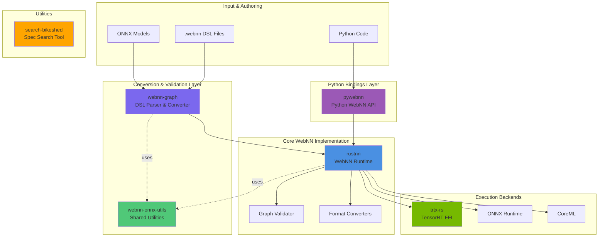
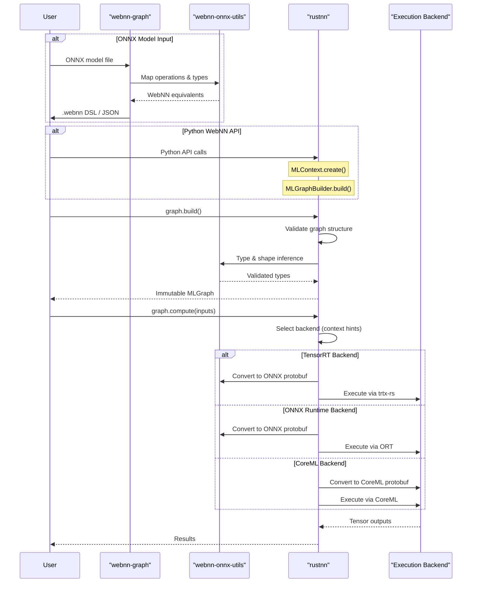

# rustnn Workspace

A multi-project workspace for W3C WebNN (Web Neural Network) implementation, specification tooling, and GPU acceleration.

## Quick Start

```bash
# Clone all repositories and set up the workspace
make setup

# Build all projects
make build

# Run tests
make test
```

## Architecture Overview

This workspace implements a complete WebNN toolchain, from model conversion to multi-backend execution.

### System Architecture



### Component Responsibilities

| Component | Purpose | Key Features |
|-----------|---------|--------------|
| **rustnn** | Core WebNN runtime | • W3C spec-compliant implementation<br/>• Multi-backend execution<br/>• Rust library crate<br/>• 88/105 operations (84% coverage) |
| **pywebnn** | Python bindings | • Full W3C WebNN Python API<br/>• PyO3 bindings to rustnn<br/>• NumPy integration<br/>• PyPI package distribution |
| **webnn-graph** | DSL & visualization | • .webnn text format parser<br/>• ONNX → WebNN conversion<br/>• Graph validation & visualization<br/>• JavaScript code generation |
| **webnn-onnx-utils** | Shared utilities | • Type/operation mapping<br/>• Attribute parsing<br/>• Shape inference<br/>• Used by rustnn & webnn-graph |
| **trtx-rs** | GPU acceleration | • Safe TensorRT-RTX bindings<br/>• RAII-based API<br/>• Mock mode for dev without GPU<br/>• AOT compilation + runtime inference |
| **search-bikeshed** | Spec tooling | • Index W3C WebNN specs<br/>• Full-text search (SQLite FTS5)<br/>• Offline spec browsing |

### Data Flow Architecture



### Internal Architecture: rustnn Core

rustnn follows the W3C WebNN specification with a multi-layered architecture:

```
┌─────────────────────────────────────────────────────────────┐
│                     API Layer                                │
│  ┌──────────────┐  ┌──────────────┐  ┌──────────────┐      │
│  │   CLI Tool   │  │  Rust Crate  │  │Python Bindings│     │
│  │  (main.rs)   │  │   (lib.rs)   │  │   (PyO3)      │     │
│  └──────────────┘  └──────────────┘  └──────────────┘      │
└────────────────────────┬────────────────────────────────────┘
                         │
┌────────────────────────┼────────────────────────────────────┐
│              Core Graph Processing                           │
│  ┌─────────────────────────────────────────────────────┐    │
│  │  MLGraphBuilder (builder.rs)                        │    │
│  │  • input(), constant(), conv2d(), relu(), etc.      │    │
│  │  • Builds backend-agnostic graph                    │    │
│  └─────────────────────┬───────────────────────────────┘    │
│                        │                                     │
│  ┌─────────────────────▼───────────────────────────────┐    │
│  │  GraphValidator (validator.rs)                      │    │
│  │  • Shape inference (shape_inference.rs)             │    │
│  │  • Type checking                                    │    │
│  │  • Dependency analysis                              │    │
│  └─────────────────────┬───────────────────────────────┘    │
│                        │                                     │
│  ┌─────────────────────▼───────────────────────────────┐    │
│  │  GraphInfo (graph.rs) - Immutable                   │    │
│  │  • Operations + Operands                            │    │
│  │  • Input/Output descriptors                         │    │
│  │  • Constant data (weights)                          │    │
│  └─────────────────────┬───────────────────────────────┘    │
└────────────────────────┼────────────────────────────────────┘
                         │
┌────────────────────────┼────────────────────────────────────┐
│              Backend Selection (Runtime)                     │
│  ┌─────────────────────▼───────────────────────────────┐    │
│  │  MLContext::select_backend()                        │    │
│  │  • accelerated: bool                                │    │
│  │  • power_preference: "low-power" | "high-perf"      │    │
│  │  • Platform capabilities check                      │    │
│  └─────────────────────┬───────────────────────────────┘    │
└────────────────────────┼────────────────────────────────────┘
                         │
        ┌────────────────┼────────────────┐
        │                │                │
┌───────▼──────┐  ┌──────▼──────┐  ┌─────▼──────┐
│  TensorRT    │  │ ONNX Runtime│  │  CoreML    │
│   Backend    │  │   Backend   │  │  Backend   │
├──────────────┤  ├─────────────┤  ├────────────┤
│• ONNX Conv   │  │• ONNX Conv  │  │• CoreML    │
│• trtx-rs FFI │  │• ORT C API  │  │  Conv      │
│• GPU Exec    │  │• CPU/GPU    │  │• macOS GPU │
│              │  │  Exec       │  │  /Neural   │
│              │  │             │  │  Engine    │
└──────────────┘  └─────────────┘  └────────────┘
```

### Backend Selection Strategy

rustnn implements the [W3C WebNN Device Selection Explainer](https://github.com/webmachinelearning/webnn/blob/main/device-selection-explainer.md):

```python
# User provides hints, platform selects optimal backend
context = ml.createContext({
    'deviceType': 'gpu',           # accelerated=true
    'powerPreference': 'high-performance'
})
```

**Selection Logic** (rustnn/src/python/context.rs:473):

| Hints | Platform | Selected Backend | Device |
|-------|----------|------------------|--------|
| `accelerated=false` | Any | ONNX Runtime | CPU only |
| `accelerated=true`<br/>`power=low-power` | Any | ONNX Runtime / CoreML | NPU > GPU > CPU |
| `accelerated=true`<br/>`power=high-performance` | Linux/Windows | TensorRT | NVIDIA GPU |
| `accelerated=true`<br/>`power=high-performance` | macOS | CoreML | GPU / Neural Engine |
| `accelerated=true`<br/>`power=default` | Any | TensorRT / CoreML / ORT | Best available |

**Key Principles**:
- Backend selection at **context creation** (not compile-time)
- Same graph can execute on multiple backends
- Platform autonomously selects actual device
- Feature flags control availability, not selection

### Shared Code: webnn-onnx-utils

webnn-onnx-utils provides the single source of truth for ONNX/WebNN interoperability:

```
webnn-onnx-utils/
├── data_types.rs          Type mapping (WebNN ↔ ONNX)
├── operation_names.rs     90+ operation mappings
├── attributes.rs          ONNX attribute parsing/building
├── shape_inference.rs     Operation shape rules
├── tensor_data.rs         Tensor serialization
└── identifiers.rs         Naming conventions

Used by:
  rustnn/src/converters/onnx.rs     (WebNN → ONNX export)
  webnn-graph/src/onnx/convert.rs   (ONNX → WebNN import)
```

This ensures consistent behavior across:
- **ONNX Import** (webnn-graph): ONNX model → WebNN graph
- **ONNX Export** (rustnn): WebNN graph → ONNX execution
- **Type System**: Unified data type handling
- **Operation Semantics**: Consistent operation mappings

### Development Workflow Example

```bash
# 1. Convert ONNX model to WebNN
cd webnn-graph
cargo run -- convert model.onnx --output model.webnn

# 2. Validate and visualize
cargo run -- validate model.webnn
cargo run -- visualize model.webnn --html

# 3. Execute with Python API (using rustnn)
python3 << EOF
import pywebnn as ml
import numpy as np

# Create context (selects backend)
context = ml.MLContext()

# Load graph
with open('model.webnn') as f:
    graph = context.load(f.read())

# Execute
inputs = {'input': np.random.randn(1, 3, 224, 224).astype(np.float32)}
outputs = graph.compute(inputs)
print(outputs)
EOF

# 4. Or use TensorRT explicitly (Linux/Windows with NVIDIA GPU)
cd rustnn
cargo run --features tensorrt -- execute model.webnn input.npy
```

## Workspace Structure

This workspace includes the following projects:

- **rustnn** - Core WebNN implementation (Rust library)
- **pywebnn** - Python bindings for rustnn (PyO3)
- **trtx-rs** - TensorRT integration for Rust
- **webnn-graph** - WebNN graph DSL and visualizer
- **webnn-onnx-utils** - ONNX utilities for WebNN
- **search-bikeshed** - WebNN specification search tool

## Available Commands

Run `make help` to see all available commands:

- `make setup` - Clone all repositories and set up the workspace
- `make clone` - Clone all project repositories
- `make build` - Build all workspace members
- `make build-release` - Build in release mode with optimizations
- `make test` - Run all tests
- `make check` - Run cargo check
- `make fmt` - Format all code
- `make clippy` - Run clippy linter
- `make clean` - Clean build artifacts
- `make update` - Pull latest changes from all repositories
- `make status` - Show git status for all projects

## Development Workflow

1. **Initial setup**: `make setup`
2. **Make changes** in any of the sub-projects
3. **Build**: `make build`
4. **Test**: `make test`
5. **Format**: `make fmt`
6. **Check**: `make clippy`

## Working with Individual Projects

Each project is a git repository. You can work on them independently:

```bash
cd rustnn
git checkout -b my-feature
# make changes
git commit -m "Add feature"
git push origin my-feature
```

## Workspace Benefits

- **Unified dependency management**: Shared dependencies across projects
- **Cross-project refactoring**: Changes can span multiple crates
- **Single build command**: Build all projects together
- **Consistent tooling**: Shared formatting and linting rules
